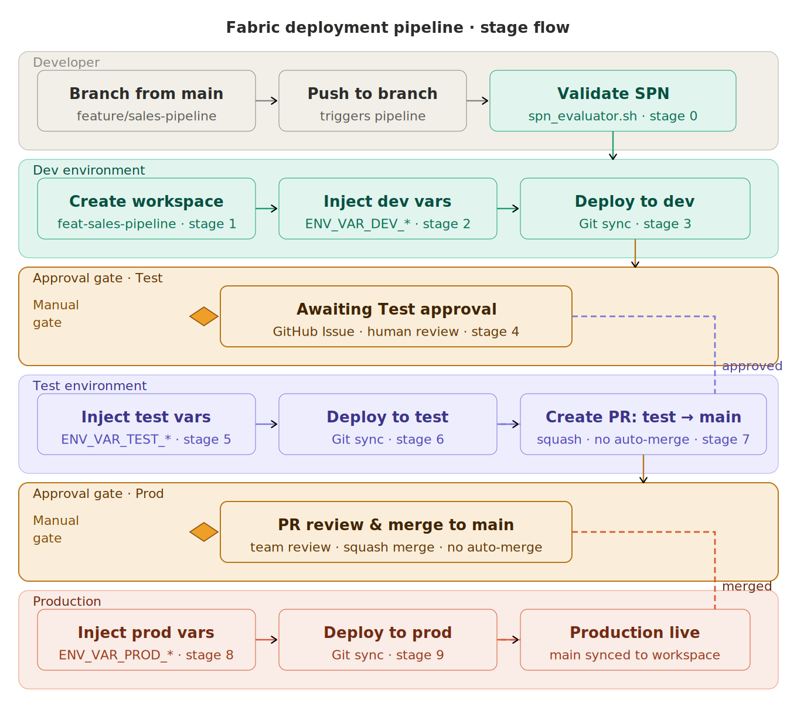
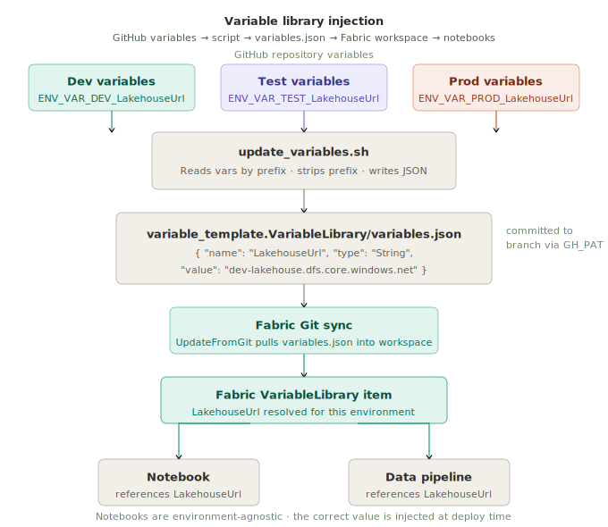

# Fabric Deployment Pipeline

A fully automated CI/CD pipeline for Microsoft Fabric workspaces using GitHub Actions. Every developer gets a **dedicated, isolated Fabric workspace** for the duration of their feature branch so work can be built, validated, and cherry-picked in a real Fabric environment before it ever touches a shared space.

---

## Table of Contents

1. [Overview](#1-overview)
2. [Branch Strategy](#2-branch-strategy)
3. [Why Isolated Workspaces](#3-why-isolated-workspaces)
4. [Developer Journey](#4-developer-journey)
5. [Pipeline Stages Reference](#5-pipeline-stages-reference)
6. [Microsoft Fabric Deployment Patterns](#6-microsoft-fabric-deployment-patterns)
7. [Environment Variable Management](#7-environment-variable-management)
8. [One-Time Repository Setup](#8-one-time-repository-setup)
9. [Workflow File Reference](#9-workflow-file-reference)
10. [Troubleshooting](#10-troubleshooting)

---

## 1. Overview

The pipeline covers three environments Dev, Test, and Production with human approval gates before each promotion. All Fabric workspace provisioning, Git synchronisation, and variable injection is handled automatically by GitHub Actions. Developers only need to push code.

| Environment | Workspace | Trigger | Approval |
|---|---|---|---|
| Dev | `feat-<branch>` (ephemeral, per-developer) | Push to `feature/**` | None automatic |
| Test | `TEST_WORKSPACE_ID` (shared) | After Dev deploy | Yes GitHub Issue approval |
| Prod | `PROD_WORKSPACE_ID` (shared) | PR merged `test → main` | Yes PR review |

---

## 2. Branch Strategy

All developers branch directly from `main`. There is no long-lived `develop` branch.

```
main ─────────────────────────────────────────────────────────────────▶
    │                         ▲
    └─▶ feature/my-change               │
         │                    │ squash merge
         │ [auto: create feat workspace]     │
         │ [auto: deploy to dev]         │
         │                    │
         │ [gate: Test approval]         │
         │                    │
         │ [auto: deploy to test] ──▶ test ───┘
         │                    │
         └──────────────────────────────────────▶ │ squash merge (manual PR)
                             │
                             main ──▶ [auto: deploy to prod]
```

- **`main`** production state. All feature branches originate here. Never committed to directly.
- **`feature/**`** short-lived per-developer branches. Each triggers the full pipeline on push. Should be deleted after merge.
- **`test`** the integration branch that acts as the source for the `test → main` production PR. The pipeline creates this PR automatically after a successful Test deployment.

---

## 3. Why Isolated Workspaces

Standard Fabric development without isolation forces all developers to share the same workspace. This creates:

- **Overwrite conflicts** two developers pushing to the same Fabric items simultaneously corrupt each other's work
- **Broken shared environments** a half-finished feature deployed alongside someone else's work breaks the entire team's testing
- **No safe validation space** developers cannot test their changes end-to-end in a real Fabric environment without risking the shared one
- **Cherry-pick problems** without isolation there is no clean way to promote a single feature independently of other in-flight work

This pipeline follows Microsoft's recommended **workspace-per-developer** isolation pattern. Each `feature/**` push automatically provisions a dedicated Fabric workspace, links it to GitHub, and tears it down when no longer needed. Your workspace is yours iterate freely, break things, fix things, and only promote when confident.

---

## 4. Developer Journey

### Step 1 Branch off main

```bash
git checkout main
git pull
git checkout -b feature/my-change
```

Use the `feature/` prefix. This is the only convention the pipeline enforces.

---

### Step 2 Push your changes

```bash
git add .
git commit -m "add sales reporting pipeline"
git push origin feature/my-change
```

The pipeline triggers immediately. Your original commit message flows through every downstream stage bot commits and PR titles will reflect what you wrote, not generic automation messages.

---

### Step 3 Your isolated workspace is provisioned

The pipeline creates a Fabric workspace named `feat-my-change`, assigns it to the Dev capacity, connects it to your GitHub branch, and adds the configured workspace admin. If the workspace already exists from a previous push to the same branch, this step is skipped.

This workspace is yours for the life of the branch. Every subsequent push syncs it automatically.

---

### Step 4 Dev variables are injected and workspace is synced



Before syncing, the pipeline reads all `ENV_VAR_DEV_*` variables from the repository and writes them to `variable_template.VariableLibrary/variables.json`. This ensures your workspace always runs with the correct Dev configuration connection strings, storage accounts, API endpoints without any manual setup.

---

### Step 5 Validate in your workspace

Open Fabric, navigate to your `feat-my-change` workspace, and validate your items. Because this workspace is connected to your branch, it always reflects your latest push. You can:

- Run notebooks and pipelines end-to-end
- Inspect datasets and semantic models
- Cherry-pick specific items to validate without touching shared environments
- Iterate as many times as needed each push re-syncs the workspace

---

### Step 6 Approve promotion to Test

When ready to promote, the pipeline pauses and opens a GitHub Issue titled **"Deploy to Test Environment"**. A member of the `Data-Alchemy` team approves by commenting on the issue.

This gate protects the shared Test environment. Nothing reaches Test until a human has validated the Dev state.

---

### Step 7 Test deployment

After approval, the pipeline injects `ENV_VAR_TEST_*` variables and syncs the shared Test workspace with your branch. This is the integration environment the place where your change is validated alongside the rest of the team's work.

---

### Step 8 Pipeline creates the production PR

After successful Test deployment, the pipeline automatically opens a Pull Request from `test → main`. The PR title is taken from your original commit message. It is configured with:

- `auto-approve: false` a reviewer must approve
- `auto-merge: false` the team decides when to merge
- `squash: true` commits are squashed for a clean `main` history

If a PR between these branches already exists, creation is skipped and the existing PR is reused.

---

### Step 9 Merge to ship to Production

When the `test → main` PR is reviewed and merged, the pipeline triggers one final time. It injects `ENV_VAR_PROD_*` variables and syncs the Production workspace from `main`. No further developer action is needed.

---

## 5. Pipeline Stages Reference

All stages run as jobs in `fabric-deployment-pipeline.yml`. Stages 0–7 are triggered by a push to `feature/**`. Stages 8–9 are triggered by a `pull_request` closed event on `main` where the head branch is `test`.

| Stage | Job | Trigger | What it does |
|---|---|---|---|
| 0 | Validate SPN permissions | All pushes | Runs `spn_evaluator.sh`, captures user commit message for downstream use |
| 1 | Create feature workspace | `feature/**` push | Provisions `feat-<branch>` workspace on Dev capacity via `create-fabric-workspace.yml` |
| 2 | Update Dev variables | `feature/**` push | Reads `ENV_VAR_DEV_*` vars, writes `variables.json`, commits to branch |
| 3 | Deploy to Dev | `feature/**` push | Syncs Dev workspace with branch via `update-workspace-git.yml` |
| 4 | Wait for Test approval | `feature/**` push | Pauses pipeline, opens GitHub Issue for manual approval |
| 5 | Update Test variables | After approval | Reads `ENV_VAR_TEST_*` vars, writes `variables.json`, commits to branch |
| 6 | Deploy to Test | After approval | Syncs Test workspace with branch via `update-workspace-git.yml` |
| 7 | Create PR: test → main | After Test deploy | Creates PR via `create-gitflow-pr.yml` (no auto-approve, no auto-merge) |
| 8 | Update Prod variables | PR merged to `main` | Reads `ENV_VAR_PROD_*` vars, writes `variables.json`, commits to `main` |
| 9 | Deploy to Production | After Prod vars | Syncs Production workspace from `main` via `update-workspace-git.yml` |

---

## 6. Microsoft Fabric Deployment Patterns

This pipeline is built on top of Microsoft's recommended patterns for Fabric CI/CD. Understanding these patterns helps when extending or debugging the pipeline.

---

### 6.1 Git Integration in Microsoft Fabric

Microsoft Fabric has native Git integration that allows workspaces to be connected to a GitHub or Azure DevOps repository branch. When a workspace is connected:

- Fabric items (notebooks, pipelines, semantic models, lakehouses) are represented as folders in the repository
- Changes committed to the branch can be pulled into the workspace via the **UpdateFromGit** operation
- Changes made directly in the workspace can be pushed back to the branch via the **CommitToGit** operation

The pipeline uses the [Fabric Git Integration REST API](https://learn.microsoft.com/en-us/rest/api/fabric/core/git) to automate this. The `update-workspace-git.yml` workflow handles the full connection lifecycle:

1. `GET /workspaces/{id}/git/status` checks whether the workspace is connected and initialized
2. `POST /workspaces/{id}/git/connect` connects the workspace to GitHub if not already connected
3. `POST /workspaces/{id}/git/initializeConnection` initializes the Git integration, which may return a `requiredAction` of `UpdateFromGit` or `CommitToGit`
4. `POST /workspaces/{id}/git/updateFromGit` or `POST /workspaces/{id}/git/commitToGit` performs the required sync action
5. Long-running operations (HTTP 202) are polled via `GET /operations/{operationId}` until `Succeeded` or `Failed`

This means the pipeline is resilient to workspace state it handles disconnected, connected-but-uninitialised, and fully initialised workspaces without manual intervention.

---

### 6.2 Deployment Pipeline Pattern vs Git-Based Pattern

Microsoft supports two primary CI/CD patterns for Fabric:

**Deployment Pipelines (built into Fabric)**

Fabric has a native deployment pipeline feature that creates Dev → Test → Prod promotion flows through the Fabric portal. Items are promoted by copying them between workspaces. This is low-code and easy to set up but has limitations:

- Less flexibility for custom approval gates and variable injection
- Harder to integrate with external CI/CD systems (GitHub Actions, Azure DevOps)
- Does not support Git-synced workspaces natively alongside deployment pipelines
- Limited scripting and parameterisation support

**Git-based pattern (what this pipeline uses)**

The Git-based pattern treats the Git repository as the source of truth. Each environment has a dedicated workspace connected to a specific branch. Promotion means merging code between branches, which then triggers workspace synchronisation. This pattern:

- Integrates naturally with pull request reviews and branch protection rules
- Supports full parameterisation via variable libraries
- Works with any CI/CD platform (GitHub Actions, Azure DevOps, Jenkins)
- Provides a complete audit trail in Git history
- Aligns with Microsoft's recommended approach for teams with existing DevOps maturity

See [Microsoft Fabric lifecycle management best practices](https://learn.microsoft.com/en-us/fabric/cicd/best-practices-cicd) for the full guidance.

---

### 6.3 Variable Libraries

Fabric Variable Libraries (`*.VariableLibrary`) allow environment-specific configuration to be stored as Fabric items inside the workspace, rather than hardcoded in notebook or pipeline code. This pipeline automates their population.

The `update_variables.sh` script reads GitHub repository variables matching a prefix pattern and writes them to the `variables.json` file in the variable library definition folder. Fabric picks up these values when the workspace is synced.

Variable libraries follow the Fabric item definition schema:

```json
{
 "$schema": "https://developer.microsoft.com/json-schemas/fabric/item/variableLibrary/definition/variables/1.0.0/schema.json",
 "variables": [
  {
   "name": "DatabaseServer",
   "note": "",
   "type": "String",
   "value": "dev-sql.example.com"
  }
 ]
}
```

GitHub variable naming convention used by this pipeline:

```
ENV_VAR_DEV_DatabaseServer  → written as "DatabaseServer" in Dev workspace
ENV_VAR_TEST_DatabaseServer → written as "DatabaseServer" in Test workspace
ENV_VAR_PROD_DatabaseServer → written as "DatabaseServer" in Prod workspace
```

Your Fabric notebooks and pipelines reference `DatabaseServer` directly they have no knowledge of which environment they are in. The correct value is injected at deploy time.

---

### 6.4 Service Principal Authentication

The pipeline authenticates to the Fabric REST API using an Azure Service Principal (SPN). The SPN must have:

- **Fabric workspace admin or member role** on each target workspace
- **Contributor or admin access** to the Fabric capacity
- The **Fabric API permission** (`https://api.fabric.microsoft.com/.default`) granted in Azure AD

Token acquisition uses the OAuth2 client credentials flow:

```
POST https://login.microsoftonline.com/{tenant}/oauth2/v2.0/token
 client_id   = <AZURE_CLIENT_ID>
 client_secret = <AZURE_CLIENT_SECRET>
 scope     = https://api.fabric.microsoft.com/.default
 grant_type  = client_credentials
```

The `spn_evaluator.sh` script validates these permissions at the start of every pipeline run before any Fabric API calls are made.

> **Important:** Tenant administrators must explicitly enable **Service principals can use Fabric APIs** in the Fabric Admin portal under Tenant Settings → Developer settings. Without this, all API calls will return 403 regardless of workspace-level permissions. See [Microsoft documentation](https://learn.microsoft.com/en-us/fabric/admin/metadata-scanning-enable-read-only-apis).

---

### 6.5 Workspace-per-Developer Isolation Pattern

This is the core architectural decision in this pipeline. Microsoft explicitly recommends isolated workspaces for developer environments in the [Fabric lifecycle management documentation](https://learn.microsoft.com/en-us/fabric/cicd/cicd-overview).

The pattern works as follows:

- Each developer has their own Fabric workspace connected to their feature branch
- The workspace is provisioned on the same capacity as the shared Dev workspace but is entirely independent
- Developers can commit, revert, and re-sync without affecting anyone else
- When work is complete, the feature branch is merged and the workspace can be decommissioned

This is analogous to the database-per-developer pattern used in traditional software development and solves the same class of problems: environment conflicts, overwrite races, and the inability to test in isolation.

---

## 7. Environment Variable Management

All environment-specific configuration lives in GitHub Settings → Variables. The pipeline reads the appropriate prefix at each stage and writes to `variable_template.VariableLibrary/variables.json` before deploying.

**Naming convention:**

```
ENV_VAR_<ENVIRONMENT>_<VariableName>
```

**Example:**

```
ENV_VAR_DEV_StorageAccountName  = devstorageaccount
ENV_VAR_TEST_StorageAccountName = teststorageaccount
ENV_VAR_PROD_StorageAccountName = prodstorageaccount

ENV_VAR_DEV_SqlConnectionString = Server=dev-sql.example.com;Database=MyDB
ENV_VAR_TEST_SqlConnectionString = Server=test-sql.example.com;Database=MyDB
ENV_VAR_PROD_SqlConnectionString = Server=prod-sql.example.com;Database=MyDB
```

The `update_variables.sh` script strips the prefix before writing Fabric only ever sees `StorageAccountName` and `SqlConnectionString`. Your notebook code is environment-agnostic.

You never edit `variables.json` manually. Update the GitHub Variable and push the pipeline handles the rest.

---

## 8. One-Time Repository Setup

A setup script is provided to configure all required GitHub secrets and variables in one command. Requires the GitHub CLI (`gh`) installed and authenticated.

```bash
chmod +x setup-github-actions.sh

./setup-github-actions.sh \
 -r your-org/your-repo \
 --tenant-id    <AZURE_TENANT_ID> \
 --client-id    <AZURE_CLIENT_ID> \
 --client-secret  <AZURE_CLIENT_SECRET> \
 --fabric-conn   <FABRIC_CONNECTION_ID> \
 --admin-id     <WORKSPACE_ADMIN_EMAIL_OR_GROUP_ID> \
 --dev-cap     <DEV_CAPACITY_ID> \
 --test-cap     <TEST_CAPACITY_ID> \
 --prod-cap     <PROD_CAPACITY_ID> \
 --dev-ws      <DEV_WORKSPACE_ID> \
 --test-ws     <TEST_WORKSPACE_ID> \
 --prod-ws     <PROD_WORKSPACE_ID>
```

**What the script configures:**

| Type | Name | Description |
|---|---|---|
| Secret | `AZURE_TENANT_ID` | Azure AD tenant ID |
| Secret | `AZURE_CLIENT_ID` | Service Principal client ID |
| Secret | `AZURE_CLIENT_SECRET` | Service Principal client secret |
| Secret | `AZURE_CREDENTIALS` | JSON credentials object for `azure/login` action |
| Secret | `GH_PAT` | GitHub PAT with `repo` scope needed to commit `variables.json` back to the branch |
| Variable | `FABRIC_CONNECTION_ID` | The GitHub connection ID created in the Fabric portal (Settings → Connections) |
| Variable | `WORKSPACE_ADMIN_ID` | User or group ID added as admin to every feature workspace |
| Variable | `DEV_CAPACITY_ID` | Fabric capacity used for ephemeral feature workspaces |
| Variable | `TEST_CAPACITY_ID` | Fabric capacity for the shared Test workspace |
| Variable | `PROD_CAPACITY_ID` | Fabric capacity for the Production workspace |
| Variable | `DEV_WORKSPACE_ID` | ID of the persistent shared Dev workspace |
| Variable | `TEST_WORKSPACE_ID` | ID of the shared Test workspace |
| Variable | `PROD_WORKSPACE_ID` | ID of the Production workspace |

**Before running the script, ensure:**

- The Azure SPN exists and has Fabric workspace permissions on all three workspaces
- Tenant admins have enabled "Service principals can use Fabric APIs" in the Fabric Admin portal
- A GitHub Connection has been created in the Fabric portal and the `FABRIC_CONNECTION_ID` is the UUID from that connection
- The GitHub CLI is authenticated: `gh auth login`

---

## 9. Workflow File Reference

| File | Type | Purpose |
|---|---|---|
| `fabric-deployment-pipeline.yml` | Orchestrator | Main pipeline triggers on `feature/**` push and `pull_request` closed on `main` |
| `create-fabric-workspace.yml` | Reusable | Provisions and Git-links a Fabric workspace, adds admin |
| `delete-fabric-workspace.yml` | Reusable | Deletes a named Fabric workspace via API |
| `update-workspace-git.yml` | Reusable | Full Git sync lifecycle: connect → init → UpdateFromGit/CommitToGit |
| `create-gitflow-pr.yml` | Reusable | Creates a PR between two branches, handles existing PRs, supports auto-approve and auto-merge |
| `scripts/update_variables.sh` | Script | Reads GitHub variables by prefix, writes Fabric `variables.json` |
| `scripts/spn_evaluator.sh` | Script | Validates SPN permissions against Fabric API before pipeline runs |
| `scripts/create_workspace.sh` | Script | Creates Fabric workspace and links to GitHub branch via REST API |
| `scripts/add_ws_admin.sh` | Script | Grants admin role to a user or group on a workspace |
| `scripts/delete_workspace.sh` | Script | Deletes a Fabric workspace by name |

---

## 10. Troubleshooting

| Symptom | Likely cause | Fix |
|---|---|---|
| Stage 0 fails SPN permission error | SPN not enabled in Fabric Admin portal | Enable **Service principals can use Fabric APIs** in Fabric tenant settings |
| `ConnectionNotFound` on workspace connect | Wrong `FABRIC_CONNECTION_ID` | Re-check the UUID in Fabric portal → Settings → Connections |
| `variables.json` not updated / push fails | `GH_PAT` missing or expired | Regenerate a PAT with `repo` scope, update the `GH_PAT` secret |
| Workspace creation skipped | Workspace already exists from a prior run | Correct behaviour existing workspaces are reused, not recreated |
| PR already exists warning in Stage 7 | Feature branch was pushed multiple times | Correct behaviour the existing PR is reused and the stage continues |
| Prod deploy not triggered after merge | PR was not from `test` to `main` | Verify PR head is `test` and base is `main` the condition checks both explicitly |
| LRO timeout on workspace sync | Fabric API taking longer than expected | Re-run the deploy job all sync operations are idempotent |
| Test deployment overwrites another developer's work | Two feature branches promoted to Test simultaneously | Co-ordinate promotions with your team Test is a shared environment |
| `git push` rejected in variable update step | Branch protection rules preventing bot commits | Add `github-actions[bot]` as an allowed bypass actor on the branch protection rule |

---

## Further Reading

- [Microsoft Fabric CI/CD overview](https://learn.microsoft.com/en-us/fabric/cicd/cicd-overview)
- [Fabric lifecycle management best practices](https://learn.microsoft.com/en-us/fabric/cicd/best-practices-cicd)
- [Fabric Git integration documentation](https://learn.microsoft.com/en-us/fabric/cicd/git-integration/intro-to-git-integration)
- [Fabric Git Integration REST API reference](https://learn.microsoft.com/en-us/rest/api/fabric/core/git)
- [Fabric deployment pipelines documentation](https://learn.microsoft.com/en-us/fabric/cicd/deployment-pipelines/intro-to-deployment-pipelines)
- [Service Principal access to Fabric APIs](https://learn.microsoft.com/en-us/fabric/admin/metadata-scanning-enable-read-only-apis)
- [Fabric Variable Libraries](https://learn.microsoft.com/en-us/fabric/cicd/variable-library/variable-library-overview)
